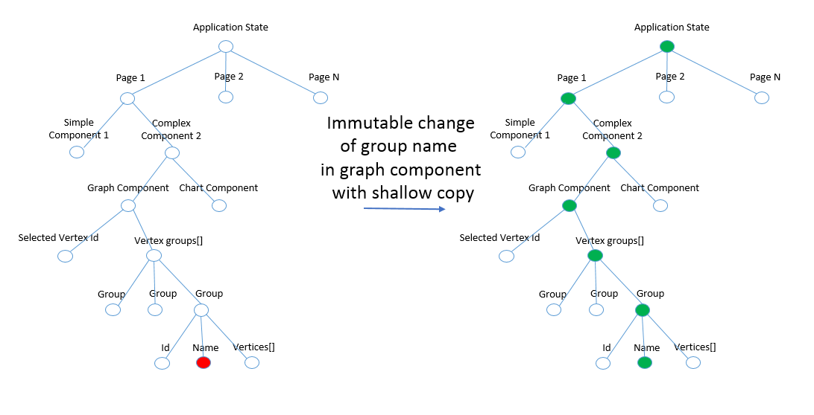

# FUN-Model

## About
I spent long time in last month in flux like libraries and there is my notes for presentation purposes. I hope that should be helpful for you in your decisions about flux. Why fun?
* f - functional
* u - unidirectional
* n - I don't know
* model - just Model or ViewModel

## Resources
### Bobril
* https://github.com/Bobris/Bobril

### Flux
* https://facebook.github.io/flux/docs/overview.html#content

### Reflux
* https://github.com/spoike/refluxjs

### Redux
* reducers + flux
* immutability
* pure functionality
* https://www.youtube.com/watch?v=xsSnOQynTHs
* https://github.com/gaearon/redux

## Notes
### Common keywords
* 1 store with 1 global application state
* application state is composition of sub states
* cursors are pointers to sub states
* action calls has specified cursor and own handler function
 * immutability
 * replaces part of global state
 * creates new state instance
* Bobril and ReactJs is only rendering tool
 * "components are stateless"
* support for unit testing
* we need rendering (frame) for each visible modification

## Lifecycle
* Store - persists global application state
* Views/Pages - gui stateless components
* Actions - creates new state or sub states in global application state
  * Cursors - pointers to sub states
  * Handlers - new state creators which gets current state for specific cursor and gives new instance of the same state type
* Action creator
  * gets state for handlers by cursor from global state
  * sets new state from handlers
  * if new state isn't same as previous frame then calls render for new frame


### Immutable or Mutable?
* immutable object is object that its sub objects can't be never mutated.
* otherwise if you have mutable object you can do everything with its sub objects.
* e.g. push new item into array:
 * mutable:
 ```
 let newLength = array.push(newItem)
 ```
 * immutable:
   * just create new array
  ```
  let newInstanceOfArrayState = [...oldArrayState, newItem]; // it's pretty easy  
  let oldStateAsSameInstance = [...oldArrayState]; // beware doesn't work  
  ```

#### The common mutability
* let's call action which changes name of third group in graph component


* next frame renders all components of application (we haven't got router for page 1 to page N)
* router might be optimization for question, What should be rendered again in next frame?
  * renders only one page which is derived from current url
* what we can do with page rendering optimization?
 * immutability and instance comparing might be option

#### The immutability with deep copy


#### The immutability with shallow copy


